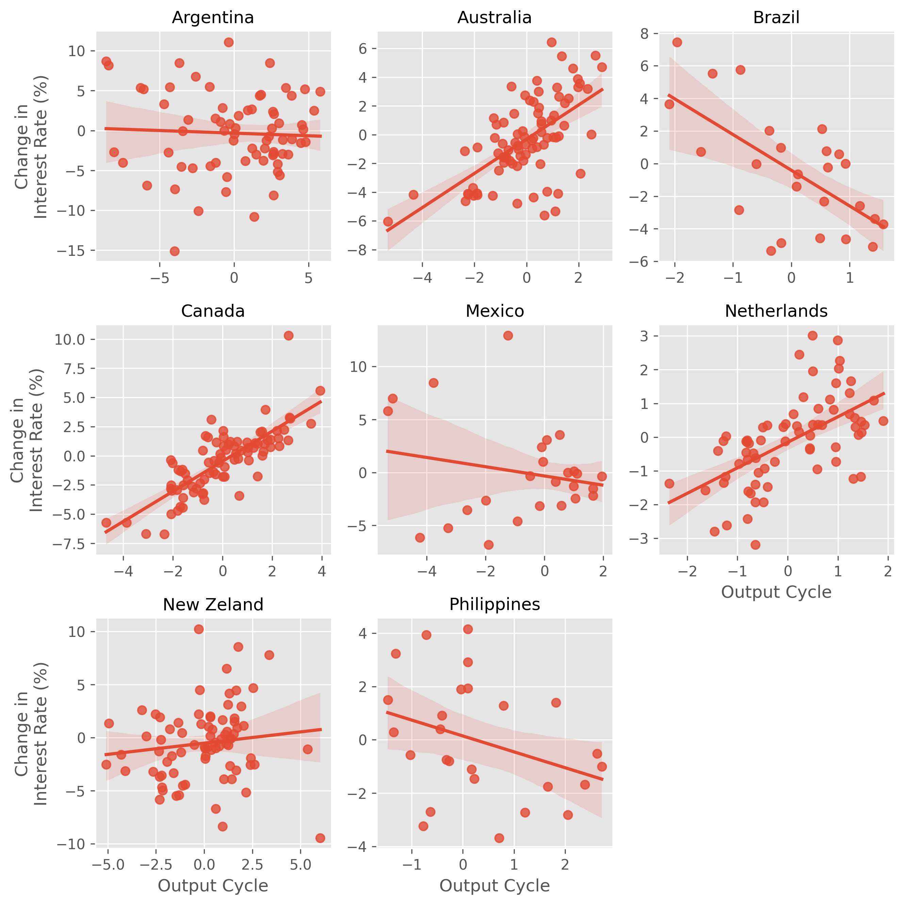

# Interest Rates in Emerging Markets
- This notebook studies interest rates in emerging markets and developed markets to illustrate the principles of Neumeyer and Perri (2006).

### Data
- Replication data from [Neumeyer and Perri (2006)](https://ideas.repec.org/a/eee/moneco/v52y2005i2p345-380.html)

### Methods
- Data wrangling - clean missing values, pivot tables, seasonal adjustment
- Regression - regressing change in interest rates on output growth
- Visualizations - seaborn, matplotlib

### Findings
- Interest rates in emerging markets *increase* during a recession

- Interest rates in developed market *decrease* during a recession

