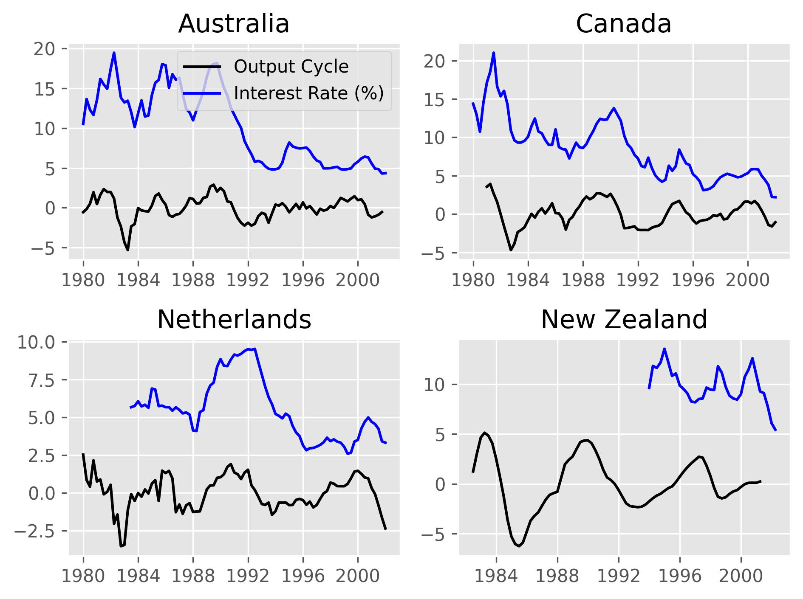
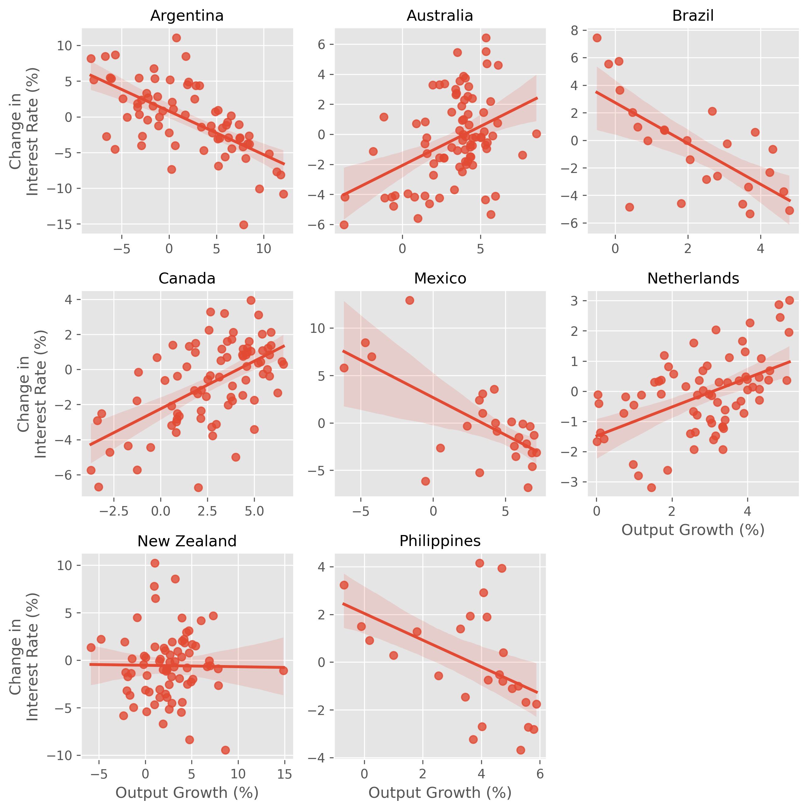

# Interest Rates in Emerging Markets
- This notebook studies interest rates in emerging markets and developed markets to illustrate the principles of Neumeyer and Perri (2006).

### Data
- Replication data from [Neumeyer and Perri (2006)](https://ideas.repec.org/a/eee/moneco/v52y2005i2p345-380.html)

| Notebook | Description | 
| --- | --- | 
|[clean_visualize](./notebooks/clean_visualize.ipynb) | Clean data and develop visualizations in seaborn/matplotlib|

### Methods
- Data wrangling - clean missing values, pivot tables, seasonal adjustment
- Regression - regressing change in interest rates on output growth
- Visualizations - seaborn, matplotlib, Tableau

### [Tableau](https://public.tableau.com/app/profile/mitchell.vaughn4481/viz/InterestRatesinEmergingMarkets/Dashboard1?publish=yes)

### Findings
- Interest rates in emerging markets *increase* during a recession.

- Interest rates in developed market *decrease* during a recession.

- More generally, interest rates are countercyclical and *decrease* with output in emerging markets, whereas interest rates *increase* with output in developed markets.
